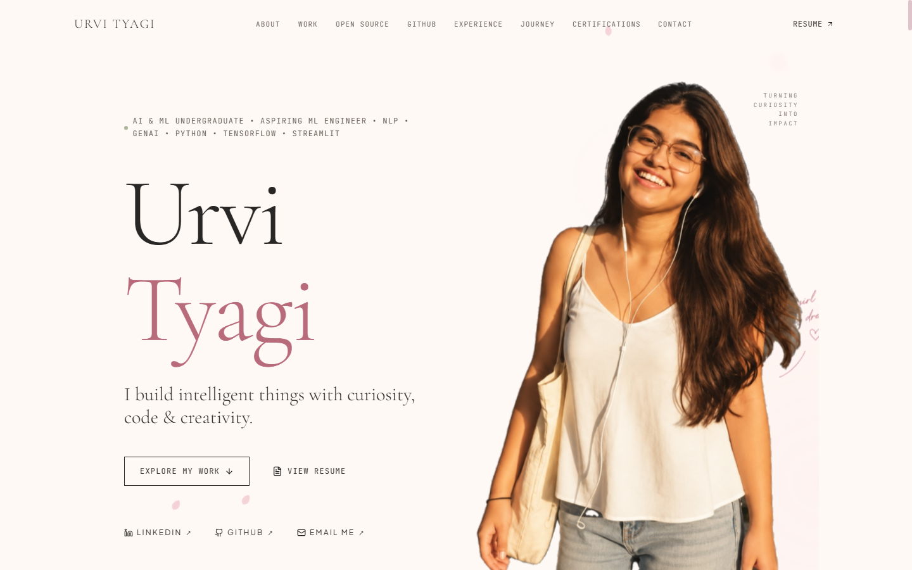

# Urvi Tyagi — AI/ML Engineer & Computer Science Portfolio

A personal portfolio website showcasing my work, projects, technical skills, certifications, and journey in Artificial Intelligence, Machine Learning, and Computer Science.

[](https://portfolio-mu-rouge-31.vercel.app/)
[](https://react.dev/)
[](https://www.typescriptlang.org/)
[](https://vitejs.dev/)
[](https://tailwindcss.com/)

---

## Live Portfolio

**[https://portfolio-mu-rouge-31.vercel.app/](https://portfolio-mu-rouge-31.vercel.app/)**

---

## Preview



---

## About

This repository contains the source code for my personal portfolio website. It is designed to present a comprehensive, recruiter-ready overview of my background as an AI & ML undergraduate and aspiring Machine Learning Engineer:

- **AI/ML & Software Projects**: In-depth case studies with problem framing, architecture diagrams, technical stacks, and direct links to code and live demos.
- **Technical Skills**: Structured breakdown of programming languages, machine learning frameworks, data science libraries, and developer tools.
- **Computer Science Background**: Academic milestones, core coursework, and learning trajectory.
- **Industry Certifications**: Verified credentials across Machine Learning, Deep Learning, Generative AI, and software engineering.
- **Open-Source Contributions**: Documented contributions to community projects such as [TermStory](https://github.com/bitflicker64/Termstory).
- **Digital Garden**: Real-time GitHub activity matrix, repository metrics, and language distribution.
- **Direct Contact & Resume**: Embedded interactive resume viewer, downloadable PDF, and direct contact channels.

---

## Features

- **Responsive, Mobile-First Editorial Layout**: Fully responsive across small phones (360px+), tablets, laptops, and ultra-wide displays with zero horizontal overflow (`overflow-x: clip`).
- **Sakura-Inspired Editorial Aesthetic**: Warm ivory canvas (`#FFF9F5`), muted Sakura rose (`#B86B7A`), and natural Matcha (`#465640`) typography and accents.
- **Spatial 3D Motion & Transitions**: Perspective camera tracking, mouse-aware tilt physics, and continuous section transitions powered by Framer Motion.
- **Smooth Momentum Scrolling**: Integrated Lenis scroll engine with automatic reduced-motion accessibility support (`prefers-reduced-motion`).
- **Selected Work & Deep-Dive Modals**: Filterable project gallery (AI/ML, NLP, Full-Stack) featuring interactive modal overlays detailing technical specifications and system architecture.
- **Open-Source Showcase**: Highlights merged pull requests and commits in external repositories with verifiable commit references.
- **Live GitHub Digital Garden**: Dynamic GitHub API integration tracking recent activity, language percentages, and a 52-week contribution heatmap with offline fallback resilience.
- **Interactive Resume Modal**: Native in-browser PDF modal viewer alongside instant download links.
- **Accessible & Performance-Optimized**: Semantic HTML5 landmarks, 44px+ touch targets, clean typographic hierarchy, and sub-2s production builds.
- **SEO & Social Graph Metadata**: Complete Open Graph, Twitter/X summary cards, and canonical URL tags for rich previews when shared.

---

## Tech Stack

### Frontend & Core
- **[React 19](https://react.dev/)** (`^19.2.8`) — Component architecture and UI state management
- **[TypeScript](https://www.typescriptlang.org/)** (`~6.0.2`) — Strict static type safety across data contracts and components
- **[Vite 8](https://vitejs.dev/)** (`^8.2.2`) — Fast development server and optimized Rollup production bundling

### Styling & Design
- **[Tailwind CSS](https://tailwindcss.com/)** (`^3.4.19`) — Utility-first styling with custom typography and color tokens
- **PostCSS** (`^8.5.28`) & **Autoprefixer** (`^10.5.5`) — Automated CSS post-processing and vendor prefixing

### Animation & Smooth Scroll
- **[Framer Motion](https://www.framer.com/motion/)** (`^13.2.0`) — Hardware-accelerated UI animations, layout springs, and 3D tilt tracking
- **[Lenis](https://lenis.darkroom.engineering/)** (`^1.3.26`) — Smooth momentum scrolling physics

### Icons & Utilities
- **[Lucide React](https://lucide.dev/)** (`^1.41.0`) — Clean, consistent iconography
- **[clsx](https://github.com/lukeed/clsx)** & **[tailwind-merge](https://github.com/dcastil/tailwind-merge)** — Dynamic class merging and collision resolution

### Code Quality
- **[Oxlint](https://oxc.rs/)** (`^1.79.0`) — Fast Rust-based JavaScript/TypeScript linter
- **TypeScript Compiler (`tsc`)** — Strict build-time type verification

### Hosting & Deployment
- **[Vercel](https://vercel.com/)** — Continuous deployment from `main` with SPA routing configuration (`vercel.json`)

---

## Project Structure

```
Portfolio/
├── public/                     # Static assets served directly
│   ├── favicon.svg             # Website favicon
│   ├── preview.png             # Social graph and README preview image
│   ├── Urvi_Tyagi_Resume.pdf   # Downloadable curriculum vitae
│   └── urvi_portrait.png       # Optimized portrait asset
├── src/
│   ├── assets/                 # Processed imagery and graphics
│   │   ├── handwritten_accent.png
│   │   └── urvi_portrait.png
│   ├── components/
│   │   ├── layout/             # Top-level shell and navigational structure
│   │   │   ├── Navbar.tsx      # Desktop header and mobile drawer navigation
│   │   │   ├── Footer.tsx      # Persistent editorial footer
│   │   │   ├── SmoothScroll.tsx# Lenis smooth scroll wrapper
│   │   │   └── SpatialSection.tsx# 3D spatial perspective wrapper
│   │   ├── sections/           # Individual page sections
│   │   │   ├── HeroSection.tsx # Editorial hero, typography, portrait cutout & CTAs
│   │   │   ├── IntroSection.tsx# Academic & engineering overview
│   │   │   ├── SelectedWork.tsx# Featured AI/ML project showcase & filters
│   │   │   ├── OpenSource.tsx  # Open-source contributions (TermStory, etc.)
│   │   │   ├── DigitalGarden.tsx# GitHub contribution heatmap & stats
│   │   │   ├── ExperienceSection.tsx# Internships and practical roles
│   │   │   ├── Journey.tsx     # Chronological milestone timeline
│   │   │   ├── Toolkit.tsx     # Technical skill matrices (ML, tools, languages)
│   │   │   ├── CertificationsSection.tsx# Industry certifications & credentials
│   │   │   ├── NowSection.tsx  # Current technical pursuits & reading
│   │   │   └── ContactSection.tsx# Communication channels & direct email copy
│   │   ├── ui/                 # Reusable UI elements (modals, tags, brand icons)
│   │   │   ├── ProjectModal.tsx
│   │   │   ├── ResumeModal.tsx
│   │   │   ├── SectionHeading.tsx
│   │   │   ├── BrandIcons.tsx
│   │   │   └── Tag.tsx
│   │   └── visuals/            # Atmospheric canvases and particle accents
│   │       ├── PetalAccents.tsx
│   │       └── SakuraNeuralCanvas.tsx
│   ├── data/                   # Data sources and static configuration
│   │   ├── portfolioData.ts    # Projects, certifications, timeline & toolkit data
│   │   └── siteConfig.ts       # Centralized contact links & metadata constants
│   ├── services/
│   │   └── github.ts           # GitHub REST API client with fallback resilience
│   ├── types/
│   │   └── portfolio.ts        # TypeScript interface contracts
│   ├── App.tsx                 # Root application composition
│   ├── index.css               # Global typography, color tokens, and utility classes
│   └── main.tsx                # React DOM root entrypoint
├── .gitignore                  # Git ignore definitions
├── .oxlintrc.json              # Oxlint lint configuration
├── index.html                  # HTML5 template with complete SEO metadata
├── package.json                # Project dependencies and operational scripts
├── preview.png                 # Repository preview screenshot
├── tailwind.config.js          # Tailwind theme tokens and color palette
├── tsconfig.json               # TypeScript compiler options
├── vercel.json                 # Vercel SPA routing and build output rules
└── vite.config.ts              # Vite bundler configuration
```

---

## Getting Started

### Prerequisites
- **Node.js**: v18.0.0 or higher
- **npm**: v9.0.0 or higher (or `pnpm` / `yarn`)

### Local Installation & Setup

1. **Clone the repository:**
   ```bash
   git clone https://github.com/Urvity03/Portfolio.git
   cd Portfolio
   ```

2. **Install dependencies:**
   ```bash
   npm install
   ```

3. **Start the development server:**
   ```bash
   npm run dev
   ```
   The application will start locally at `http://localhost:5173/`.

### Available Scripts

- **`npm run dev`** — Starts the local Vite development server with Hot Module Replacement (HMR).
- **`npm run build`** — Runs TypeScript type-checking (`tsc -b`) and produces an optimized production bundle in `dist/`.
- **`npm run preview`** — Locally serves the production `dist/` build to test production performance.
- **`npm run lint`** — Runs Oxlint to inspect TypeScript and React code quality.

---

## Environment Variables

No environment variables are currently required to run the portfolio locally. All external API requests (such as public GitHub profile and contribution statistics) use unauthenticated public endpoints with graceful fallback data if rate limits are encountered.

---

## Deployment

The portfolio is deployed to **Vercel** with automatic continuous deployment on pushes to the `main` branch.

**Live URL**: [https://portfolio-mu-rouge-31.vercel.app/](https://portfolio-mu-rouge-31.vercel.app/)

SPA client-side routing is configured in `vercel.json`:
```json
{
  "buildCommand": "npm run build",
  "outputDirectory": "dist",
  "framework": "vite",
  "rewrites": [
    {
      "source": "/(.*)",
      "destination": "/index.html"
    }
  ]
}
```

To deploy your own instance using the Vercel CLI:
```bash
npm install -g vercel
vercel
vercel --prod
```

---

## Design Philosophy

The portfolio employs a **Sakura-inspired editorial aesthetic** designed to bridge technical discipline with personal identity:

- **Restrained Spatial Depth**: Instead of heavy 3D models or generic developer cards, the design utilizes subtle multi-layer Z-axis transforms, soft ambient shadows, and gentle spring physics that respond to user motion.
- **Warm Editorial Palette**: Centered on warm ivory (`#FFF9F5`), charcoal ink (`#292725`), Sakura rose (`#B86B7A`), and Matcha olive (`#465640`) rather than stark terminal dark modes.
- **Intentional Negative Space**: Generous whitespace and asymmetric grid alignments prioritize readability, drawing immediate focus to project architectures and code impact.
- **Accessibility by Default**: High-contrast ratios, complete keyboard navigability, explicit tap targets (min 44px), and respectful motion suppression when `prefers-reduced-motion` is active.

---

## Open Source

I am an active open-source contributor:

- **[TermStory](https://github.com/bitflicker64/Termstory)** — Contributed to this open-source terminal session story generator and visualizer, with merged pull requests focused on:
  - Replacing overly broad exception handling during install log parsing.
  - Adding robust date parsing with dedicated exception handling.
  - Hardening configuration loading against `UnicodeDecodeError` across diverse terminal environments.
  - Handling edge cases when parsing user zsh history files.

View my complete open-source activity on [GitHub @Urvity03](https://github.com/Urvity03).

---

## Author

**Urvi Tyagi**  
*AI & ML Undergraduate | Aspiring Machine Learning Engineer focused on NLP & Computer Science*

- **Live Portfolio**: [portfolio-mu-rouge-31.vercel.app](https://portfolio-mu-rouge-31.vercel.app/)
- **LinkedIn**: [linkedin.com/in/urvi-tyagi026](https://www.linkedin.com/in/urvi-tyagi026/)
- **GitHub**: [github.com/Urvity03](https://github.com/Urvity03)
- **Email**: [tyagiurvi26@gmail.com](mailto:tyagiurvi26@gmail.com)

---

## License

This project and its original assets, design, and content are private personal work. All rights reserved. For questions or collaboration inquiries, feel free to reach out via [email](mailto:tyagiurvi26@gmail.com).
